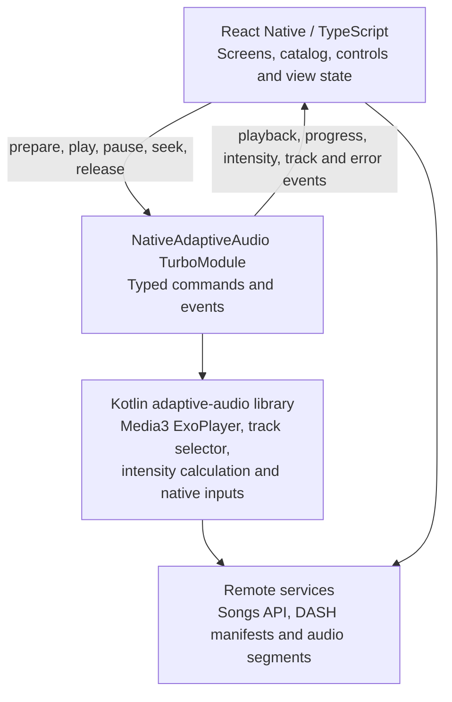

<!--
Implementation plan for migrating the Adaptizer Player Android application to React Native.
Keep this file reviewable: update dependency IDs, acceptance checks and rollback notes as steps land.
-->

# React Native Migration Plan

_Adaptizer Player - preserve adaptive audio in Kotlin, migrate the product shell incrementally_

**Status:** Proposed implementation plan

**Prepared:** 1 August 2026

**Primary release scope:** Android React Native application

**Core constraint:** Adaptive audio selection, volume input and accelerometer input remain Kotlin-owned

**Delivery model:** Small, independently reviewable pull requests with additive rollback

> **Recommended decision:** Build a new React Native shell under mobile/ while the current Android app remains buildable. Extract the adaptive audio implementation into a reusable Kotlin Gradle library and expose it through a typed Turbo Native Module. Do not replace the player with react-native-video.

## 1. Outcome and guardrails

**Target outcome.** The user interface, song catalog, network client and screen state move to React Native and TypeScript. Media3 ExoPlayer, the custom track selector, intensity calculation and device inputs remain in Kotlin. The migration ships only after the React Native app matches the current Android behavior and the legacy app remains available as a rollback reference.

- One behavior change or architectural concern per pull request; generated files are reviewed separately from authored code.
- Prefer additive changes. Do not delete or relocate the legacy app until the replacement has completed a production soak period.
- Keep track selection and sensor decisions on the Android main/native side. React Native receives state events but does not decide which DASH representation to play.
- Treat the current ten-representation DASH manifest as a compatibility contract and fail safely when a manifest is malformed or has a different track count.
- Each step includes automated checks, a manual smoke check where necessary, and an explicit rollback boundary.
- Android is the first production target. iOS is a separate follow-up because the Kotlin/Media3 engine and current DASH WebM/Opus stream are Android-specific.

### Success criteria

- The same song can be prepared, played, paused and sought from React Native controls.
- Volume and motion still produce intensity values 0-9 using Kotlin logic.
- Intensity changes select the expected representation and preserve the existing queued-chunk invalidation behavior.
- No JavaScript timer, sensor package or player library is required to make adaptation decisions.
- Network, empty-catalog, malformed-manifest and player errors are visible and recoverable.
- The React Native Android build, Kotlin library tests and end-to-end smoke suite run in CI.
- Release builds use the existing application identity and signing configuration only at the final cutover step.

### Non-goals for the migration

- Changing the intensity formula or redefining the ten audio levels.
- Repackaging the backend media or adding iOS playback during the Android migration.
- Adding background playback, downloads, playlists or notification controls unless separately approved.
- Rewriting the adaptive player in TypeScript or adopting react-native-video as the playback engine.

## 2. Target architecture

The boundary is intentionally narrow. React Native owns presentation and user intent; Kotlin owns player state, device inputs and adaptation. This prevents high-frequency sensor data and track-selection timing from depending on the JavaScript event loop.

### Target Android architecture



### Kotlin library responsibilities

- AdaptiveAudioEngine: owns ExoPlayer, media preparation, transport commands, progress reporting and resource release.
- AdaptizerTrackSelector and AdaptizerTrackSelection: preserve explicit representation selection and queue clearing.
- Adaptizer and AdaptizerState: combine input values and calculate intensity.
- VolumeInput and AccelerometerInput: register native listeners, normalize values and clean up deterministically.
- Manifest validation: reports supported track count and refuses out-of-range selections without crashing.

### Typed bridge contract

| Direction | API | Purpose |
| --- | --- | --- |
| JS to Kotlin | prepare(sourceUri, metadata) | Create and prepare the DASH media source. |
| JS to Kotlin | play(), pause(), seekTo(ms), release() | Transport and lifecycle commands. |
| Kotlin to JS | onPlaybackState / onProgress | Drive React Native controls and progress UI. |
| Kotlin to JS | onIntensityChanged | Expose intensity, volume and acceleration for presentation only. |
| Kotlin to JS | onTrackChanged | Expose requested index, selected index and available count for diagnostics. |
| Kotlin to JS | onPlayerError | Return stable error code, message and recoverability. |

> **API constraint:** There is no production setIntensity() or selectTrack() command in the JavaScript API. Test-only input overrides may exist in debug builds, but release adaptation decisions stay inside Kotlin.

### Suggested repository layout

```text
Player/
  app/                         # current Android app; retained until cutover
  adaptive-audio/              # reusable Kotlin Android library
  mobile/                      # React Native application
    android/                   # Android host application
    src/                       # TypeScript UI, state and API client
    packages/adaptive-audio/   # typed RN native-module package
  test-media/                  # deterministic short DASH fixture
  docs/                        # ADRs and migration evidence
```

## 3. Parallel execution model

Use four lanes. A lane may advance independently until it reaches an integration dependency. Merge order follows the dependency IDs, not the order in which branches are started.

**Lane A - React Native platform.** mobile/ scaffold, Android host, TypeScript build, lint and CI

**Lane B - Kotlin adaptive engine.** library extraction, lifecycle fixes, deterministic tests and Media3 behavior

**Lane C - Product UI and data.** songs client, screens, assets, controls, loading and error states

**Lane D - Contract and quality.** Codegen spec, mocks, test fixture, parity matrix, release and rollback checks

### Merge waves

| Wave | Lane A | Lane B | Lane C | Lane D |
| --- | --- | --- | --- | --- |
| 0 | - | M00 | - | M01 |
| 1 | A01 | B01 | C01 | D01 |
| 2 | A02 | B02, B03 | C02 | D02 |
| 3 | A03 | B04 | C03 | - |
| 4 | A04 | B05 | C04 | D03 |
| 5 | Integration and release gates: I01, I02, R01, R02 | Integration and release gates: I01, I02, R01, R02 | Integration and release gates: I01, I02, R01, R02 | Integration and release gates: I01, I02, R01, R02 |

> **Branch discipline:** Each branch starts from the latest completed dependency, touches one lane where possible and targets no more than roughly 400 authored lines. Large generated Codegen output or binary test fixtures go in dedicated pull requests.

## 4. Detailed migration steps

Each item below is intended to be one pull request. If a step exceeds the stated review boundary, split it before review rather than merging a partially understood change.

### Phase 0 - Baseline and decisions

#### M00 - Record the behavioral baseline

**Lane:** B / D        **Depends on:** None        **Parallel with:** None; complete first

**Goal.** Create an objective parity target before architecture changes begin.

- Document current launch, catalog loading, first-song preparation, play, pause, seek, volume response and shake response.
- Record the current live manifest shape: one audio AdaptationSet containing ten WebM/Opus representations indexed 0-9.
- Capture a short screen recording and diagnostic log showing at least three intensity/track transitions.
- List current defects separately: empty catalog access, receiver cleanup, coroutine cancellation and hard-coded track assumptions.

**Acceptance checks**

- A reviewer can reproduce the baseline on one supported Android device.
- The parity checklist is committed under docs/migration/ and contains no proposed behavior changes.

> **Review boundary:** Documentation and evidence only; no production source changes.

#### M01 - Approve architecture and pull-request rules

**Lane:** D        **Depends on:** M00        **Parallel with:** A01, B01 and C01 after merge

**Goal.** Make the Kotlin ownership boundary and migration scope explicit.

- Add an architecture decision record selecting an additive mobile/ React Native app and an adaptive-audio/ Gradle library.
- Record Android-first scope, bare React Native CLI, TypeScript, New Architecture TurboModule and no react-native-video player dependency.
- Define stable bridge commands, events and error-code naming conventions before implementation.
- Add the pull-request template: dependency ID, manual check, rollback and screenshots/logs where relevant.

**Acceptance checks**

- Architecture review signs off on ownership boundaries and the Android-first limitation.
- No runtime dependencies are introduced.

> **Review boundary:** One ADR, one contract draft and review-template changes.

### Phase 1 - Parallel foundations

#### A01 - Create the isolated React Native shell

**Lane:** A        **Depends on:** M01        **Parallel with:** B01, C01, D01

**Goal.** Establish a buildable React Native application without touching the legacy app.

- Create mobile/ with a current supported React Native Community CLI TypeScript template.
- Use a temporary debug application ID such as com.adaptizerplayer.rn so both apps can be installed side by side.
- Add one static screen displaying the app title and build metadata.
- Commit lockfiles and pin Node, Java and package-manager versions used in CI.

**Acceptance checks**

- mobile/ builds and launches on Android.
- The existing Gradle app still builds unchanged.
- No player or sensor dependency is added.

> **Review boundary:** Template/scaffold only. Generated files are isolated from authored configuration.

#### B01 - Extract pure adaptation domain code

**Lane:** B        **Depends on:** M00        **Parallel with:** A01, C01, D01

**Goal.** Separate calculation and interfaces from Android framework classes.

- Create adaptive-audio/ as an Android library Gradle module while leaving current call sites intact.
- Move AdaptizerInput, AdaptizerState and Adaptizer behind platform-neutral Kotlin interfaces.
- Change Adaptizer to depend on input interfaces rather than concrete VolumeInput and AccelerometerInput classes.
- Add table-driven unit tests for volume, acceleration, rounding and the full expected 0-9 intensity range.

**Acceptance checks**

- Pure Kotlin tests run without an emulator.
- The legacy app compiles against the extracted types and behaves the same.

> **Review boundary:** Domain extraction only; no ExoPlayer or React Native code.

#### C01 - Create the TypeScript song API client

**Lane:** C        **Depends on:** A01        **Parallel with:** B01, D01

**Goal.** Move catalog networking into a testable React Native layer.

- Define Song and repository interfaces in TypeScript.
- Implement fetch-based access to the existing songs endpoint and centralize base URLs in configuration.
- Handle non-2xx responses, invalid JSON, empty arrays and cancellation.
- Add unit tests with mocked network responses; do not render UI yet.

**Acceptance checks**

- Tests cover success, empty catalog, server failure, invalid payload and cancellation.
- No Android permission or Kotlin code changes.

> **Review boundary:** Networking and data model only.

#### D01 - Define the typed native-module specification

**Lane:** D        **Depends on:** M01        **Parallel with:** A01, B01, C01

**Goal.** Freeze the bridge contract before native and UI implementations diverge.

- Add the Codegen TypeScript specification for prepare, play, pause, seekTo and release.
- Define typed playback, progress, intensity, track-change and error events.
- Define a stable error taxonomy: network, manifest, unsupported track, decoder, lifecycle and unknown.
- Create a JavaScript mock implementing the same contract for component tests and Storybook/test harness use.

**Acceptance checks**

- Codegen schema generation succeeds.
- Type tests reject an untyped event payload.
- The mock can drive all defined states.

> **Review boundary:** Specification and mock only; native methods remain unimplemented.

### Phase 2 - Independent implementation

#### A02 - Add React Native quality gates

**Lane:** A        **Depends on:** A01        **Parallel with:** B02, B03, C02, D02

**Goal.** Make every later React Native change automatically reviewable.

- Add formatting, linting, TypeScript checking and unit-test commands.
- Add an Android debug build job that caches dependencies but does not hide dependency drift.
- Add dependency audit and license-report output as non-blocking evidence initially.
- Document the single local command that runs the same checks as CI.

**Acceptance checks**

- A deliberate lint, type and test failure each fail CI.
- The job does not invoke or modify the legacy app build.

> **Review boundary:** CI and developer tooling only.

#### B02 - Extract the Media3 adaptive player

**Lane:** B        **Depends on:** B01        **Parallel with:** A02, C02, D02

**Goal.** Move the custom ExoPlayer behavior into a reusable Kotlin engine without changing behavior.

- Move AdaptizerTrackSelector and AdaptizerTrackSelection into adaptive-audio/.
- Introduce AdaptiveAudioEngine to own ExoPlayer, DASH media-source creation and transport operations.
- Replace MainActivity player construction with the engine while retaining the current XML controls.
- Keep queue clearing on track change and main-thread confinement explicit.

**Acceptance checks**

- The legacy app still plays the sample and switches at indices 0, 4 and 9.
- A track switch still invalidates queued chunks.
- No React Native dependency exists in adaptive-audio/.

> **Review boundary:** Mechanical engine extraction plus a minimal legacy adapter.

#### B03 - Fix native input lifecycle ownership

**Lane:** B        **Depends on:** B01        **Parallel with:** B02 if files do not overlap; otherwise immediately after

**Goal.** Make native inputs safe to embed in a longer-lived React Native host.

- Store the volume BroadcastReceiver and unregister it during release.
- Replace raw broadcast-action strings with encapsulated Android implementation details and verify API-level behavior.
- Give AccelerometerInput an owned cancellable CoroutineScope and cancel it during release.
- Make initialize() and release() idempotent and report sensor unavailability without crashing.

**Acceptance checks**

- Repeated initialize/release cycles do not leak receivers, listeners or jobs.
- Tests cover missing accelerometer and multiple release calls.

> **Review boundary:** Lifecycle fixes only; the intensity formula and switching policy do not change.

#### C02 - Build the catalog screen with a fake player

**Lane:** C        **Depends on:** C01, D01        **Parallel with:** A02, B02, B03, D02

**Goal.** Review the product UI independently from native playback.

- Recreate the title area, song list, now-playing row, intensity bar and transport controls in React Native.
- Use the D01 mock module to drive loading, playing, paused, buffering and error states.
- Reuse the existing logo and placeholder album art with accessible labels and touch targets.
- Add component tests for song selection and player-state rendering.

**Acceptance checks**

- Screenshot evidence covers normal, empty, loading and error states.
- No device, native module or live network is required for component tests.

> **Review boundary:** Presentation only; the mock is the only player dependency.

#### D02 - Add deterministic DASH test media

**Lane:** D        **Depends on:** M00        **Parallel with:** A02, B02, B03, C02

**Goal.** Test representation selection without relying solely on production CDN availability.

- Add or generate a short synchronized ten-representation DASH fixture matching the production AdaptationSet shape.
- Record fixture provenance, generation command, codec and expected representation IDs.
- Add a tiny local HTTP test server/helper for instrumentation tests.
- Keep binary fixture changes isolated in this pull request.

**Acceptance checks**

- Fixture validates with the selected DASH tooling.
- Media3 can prepare all ten representations in an instrumentation smoke test.

> **Review boundary:** Test assets and generation instructions only; no production player changes.

### Phase 3 - Bridge and integration

#### A03 - Scaffold the Android TurboModule package

**Lane:** A / D        **Depends on:** A01, D01        **Parallel with:** B04, C03

**Goal.** Create a compilable native bridge shell before connecting the real engine.

- Create mobile/packages/adaptive-audio with Codegen configuration, Android package registration and typed JavaScript export.
- Implement placeholder commands and event plumbing that report not_initialized.
- Add a native-module availability check and an Android-only fallback message.
- Keep the package independent from adaptive-audio/ until the next step.

**Acceptance checks**

- Codegen output compiles in the mobile Android app.
- The React Native test screen receives one typed placeholder event.
- iOS compilation, if enabled, receives an explicit unsupported implementation rather than an import crash.

> **Review boundary:** Bridge scaffolding only; no Media3 dependency or playback.

#### B04 - Add engine characterization tests

**Lane:** B        **Depends on:** B02, D02        **Parallel with:** A03, C03

**Goal.** Lock down Media3 behavior before exposing the engine to React Native.

- Test manifest preparation, available track count, initial index and out-of-range handling against the deterministic fixture.
- Test requested-to-selected index events for 0, 4 and 9.
- Test queue invalidation after a change and stable playback position within an agreed tolerance.
- Add one opt-in live-CDN smoke test that is not required for ordinary unit runs.

**Acceptance checks**

- Deterministic tests pass offline after fixture checkout.
- A malformed or short manifest returns a typed error rather than an index exception.

> **Review boundary:** Tests and minimal test seams only; no React Native code.

#### C03 - Connect catalog data to the React Native screen

**Lane:** C        **Depends on:** C01, C02        **Parallel with:** A03, B04

**Goal.** Complete the non-player product path using live-compatible data.

- Replace fake songs with the TypeScript repository while retaining injected fakes for tests.
- Select the first song only when the catalog is non-empty.
- Add retry, refresh and empty-catalog presentation.
- Construct the DASH URL in one tested helper rather than inside the screen component.

**Acceptance checks**

- Component tests cover successful catalog, empty catalog and retry.
- A failed request never indexes songs[0].

> **Review boundary:** Data-to-screen integration only; player remains mocked.

### Phase 4 - Native connection and product integration

#### A04 - Connect the TurboModule to AdaptiveAudioEngine

**Lane:** A / B        **Depends on:** A03, B02, B03        **Parallel with:** C04, D03

**Goal.** Make basic native playback available to React Native without adaptation integration yet.

- Add a local Gradle dependency from the native-module package to adaptive-audio/.
- Map prepare, play, pause, seekTo and release to AdaptiveAudioEngine on the required thread.
- Emit typed playback, progress and error events; keep intensity events disabled until B05.
- Release the engine on host destruction and prevent commands after release.

**Acceptance checks**

- A minimal React Native harness prepares, plays, pauses and seeks the fixture.
- Mount/unmount loops do not leave a player instance or listener behind.
- The legacy app still builds.

> **Review boundary:** Transport bridge only. No UI integration and no sensor-driven adaptation.

#### B05 - Enable Kotlin-owned adaptation through the bridge

**Lane:** B        **Depends on:** A04, B04        **Parallel with:** C04, D03 where files do not overlap

**Goal.** Restore the defining adaptive audio behavior inside the React Native host.

- Initialize native volume and accelerometer inputs when the engine becomes active.
- Feed input changes into Adaptizer and update the custom track selector entirely in Kotlin.
- Emit throttled intensity and track-change events for UI and diagnostics.
- Validate track count and clamp or reject unsupported values according to the approved contract.

**Acceptance checks**

- Changing media volume changes intensity and selected representation.
- A physical shake changes intensity on a real device.
- JavaScript logs show events but contain no track-selection command.
- Queue invalidation remains native and tested.

> **Review boundary:** Adaptive behavior only; React Native still uses the harness.

#### C04 - Connect React Native controls and intensity presentation

**Lane:** C        **Depends on:** C03, A04, D01        **Parallel with:** B05, D03

**Goal.** Replace the fake player with the typed native module without moving policy into UI code.

- Wire song selection to prepare(), transport buttons to commands and progress UI to player events.
- Render intensity and now-playing metadata from native events and catalog data.
- Handle buffering, recoverable errors and module-unavailable states.
- Keep the native module injected so component tests continue to use the D01 mock.

**Acceptance checks**

- The screen works with both the mock and a real Android module.
- No component imports Android classes or derives a track index.

> **Review boundary:** UI-to-contract integration only; no native implementation changes.

#### D03 - Create the parity and lifecycle test suite

**Lane:** D        **Depends on:** A04, B04, C04        **Parallel with:** B05 where practical

**Goal.** Automate the highest-risk integration behaviors before release polishing.

- Add Android end-to-end tests for launch, catalog display, play, pause, seek, song change and error retry.
- Add instrumentation checks for app background/foreground, screen rotation if supported, repeated mount/unmount and process recreation expectations.
- Record intensity and selected-track events during deterministic debug-input tests.
- Compare results with the M00 parity matrix and explicitly approve any difference.

**Acceptance checks**

- The suite runs against a local API/media fixture in CI where possible.
- Real-device sensor checks remain a small documented manual gate.

> **Review boundary:** Test automation only, plus debug-only test hooks if separately guarded.

### Phase 5 - Parity, hardening and release

#### I01 - Complete Android feature parity

**Lane:** Integration        **Depends on:** B05, C04, D03        **Parallel with:** None; integration gate

**Goal.** Produce the first complete React Native Android candidate.

- Resolve visual differences, back-button behavior, status-bar spacing, accessibility labels and loading transitions.
- Add user-facing messages for no accelerometer, network failure, malformed media and decoder failure.
- Remove temporary harness routes from release builds while keeping an internal debug screen.
- Update the parity matrix with evidence for every current feature.

**Acceptance checks**

- All automated checks pass.
- A reviewer completes the full M00 flow on a physical device.
- No release code path uses debug input overrides.

> **Review boundary:** Only parity gaps. New product features are deferred.

#### I02 - Performance, resilience and security pass

**Lane:** Integration / D        **Depends on:** I01        **Parallel with:** Release documentation can begin

**Goal.** Verify that the bridge and native engine behave well under real operating conditions.

- Measure cold start, catalog load, time-to-audio, track-switch latency, dropped frames and memory across repeated song changes.
- Test slow network, disconnect/reconnect, empty catalog, invalid manifest and missing representation scenarios.
- Confirm cleartext traffic is disabled, endpoints are configurable and logs contain no secrets or excessive sensor data.
- Run accessibility, dependency and release-size audits; document accepted baselines.

**Acceptance checks**

- No unreleased player, receiver, sensor listener or coroutine remains after teardown.
- Measured regressions are within approved thresholds or have explicit follow-up issues.

> **Review boundary:** Hardening and measurements only; behavior changes require separate approval.

#### R01 - Prepare controlled application cutover

**Lane:** Release        **Depends on:** I02        **Parallel with:** Rollback rehearsal

**Goal.** Replace the legacy artifact without deleting its source or losing rollback capability.

- Apply the existing production application ID, versioning, signing and store metadata to the React Native Android host.
- Verify upgrade installation over the last production version and confirm backup/data behavior.
- Create a signed internal release and execute the complete parity and lifecycle checklist.
- Tag the last legacy build and document the command to rebuild it.

**Acceptance checks**

- Upgrade and fresh-install paths both succeed.
- The signed candidate plays and adapts against production endpoints.
- Rollback build and instructions are independently verified.

> **Review boundary:** Release configuration only. No feature code changes.

#### R02 - Release, observe and retire the legacy shell

**Lane:** Release        **Depends on:** R01        **Parallel with:** Monitoring only

**Goal.** Finish migration only after production evidence supports it.

- Roll out through internal, closed and staged production tracks with defined stop thresholds.
- Monitor startup failures, playback failures, track-change errors, crashes and user feedback.
- Keep the legacy source and tag untouched during the agreed soak period.
- After sign-off, remove the legacy launcher/app module in a dedicated deletion-only pull request; retain the Kotlin library and migration evidence.

**Acceptance checks**

- No stop threshold is exceeded during soak.
- The deletion pull request contains no functional replacement code.
- Repository and release documentation point to mobile/ as the supported app.

> **Review boundary:** Staged rollout evidence, followed later by an isolated legacy deletion.

## 5. Integration and review gates

**Gate 1 - Extraction.** Legacy app behavior is unchanged after adaptive-audio/ extraction; unit and characterization tests pass.

**Gate 2 - Contract.** Codegen API and mock are approved before bridge or UI integration begins.

**Gate 3 - Basic playback.** React Native can prepare and control Kotlin playback without sensors enabled.

**Gate 4 - Adaptation.** Volume and motion drive Kotlin track changes; JavaScript remains presentation-only.

**Gate 5 - Parity.** Every M00 behavior has passing evidence and every difference is approved.

**Gate 6 - Release.** Upgrade, signing, rollback and staged rollout checks pass.

### Required checks on every integration pull request

- Legacy Android debug build until the final deletion pull request.
- adaptive-audio/ unit tests and relevant instrumentation tests.
- React Native formatting, linting, type checking and component tests.
- React Native Android debug build and Codegen regeneration check.
- Manual smoke evidence when the change crosses the native boundary.
- Explicit note confirming whether release rollback remains possible.

## 6. Rollback strategy

- Before R01: rollback is a branch revert because all work is additive and the legacy app remains the production artifact.
- During staged rollout: stop promotion, publish the tagged legacy artifact with the next valid version code if required, and preserve diagnostic logs from the candidate.
- After legacy deletion: restore only from the immutable legacy tag; never mix emergency rollback with new migration work.
- Backend endpoints and media remain unchanged during migration, so app rollback does not require a server rollback.

> **Stop conditions:** Pause rollout for unexplained crash growth, audio-start failure, missing track transitions, sustained track-switch stalls, resource leaks or inability to rebuild the tagged legacy artifact. Numeric thresholds should be filled in before R01 based on current production telemetry.

## 7. iOS follow-up (not part of Android migration)

The React Native UI and TypeScript catalog code can be cross-platform, but the retained engine cannot run on iOS: it uses Android Media3/ExoPlayer, Android volume APIs and Android sensors. The current media is also DASH with WebM/Opus representations, whereas the standard Apple playback path is AVFoundation/HLS.

1. Decide whether iOS is required before investing in an iOS native module.
2. If required, create HLS/CMAF media packaging with separately selectable intensity renditions and verify codec support.
3. Implement an equivalent Swift AVFoundation engine behind the same TypeScript contract, or select a heavier third-party native player after a prototype.
4. Reuse React Native screens and the bridge contract, but treat playback parity as a new project with its own baseline and release gates.

> **Scope protection:** Do not make the Android migration wait for iOS. Keep an explicit unsupported iOS implementation until the media and native playback design is approved.

## 8. Definition of migration complete

- mobile/ is the supported Android application and uses the production identity.
- adaptive-audio/ is the only production owner of ExoPlayer, track selection, intensity calculation and native device inputs.
- All bridge calls and events are typed, tested and documented.
- The parity matrix, hardening results, release evidence and rollback instructions are complete.
- The staged rollout and soak period finish without crossing stop thresholds.
- The legacy launcher is removed in its own pull request, while an immutable tag remains buildable.
- Known non-migration enhancements are tracked separately rather than folded into the cutover.

## Appendix A - Current-code mapping

| Current source | Migration destination |
| --- | --- |
| MainActivity.kt | Split between React Native screen orchestration and Kotlin AdaptiveAudioEngine transport calls. |
| SongsRepository.kt | Replace with the TypeScript song API client. |
| SongsAdapter.kt + XML layouts | Replace with React Native FlatList and components. |
| Adaptizer.kt / AdaptizerState.kt | Move to adaptive-audio/ and keep in Kotlin. |
| AdaptizerTrackSelector.kt | Move to adaptive-audio/ unchanged first; harden only in later isolated steps. |
| AdaptizerTrackSelection.kt | Move to adaptive-audio/ and preserve queue clearing. |
| VolumeInput.kt | Keep in Kotlin; fix receiver ownership and release. |
| AccelerometerInput.kt | Keep in Kotlin; own/cancel coroutine scope and sensor listener. |
| AndroidManifest.xml | React Native host keeps INTERNET; READ_MEDIA_AUDIO is omitted because no local audio is read. |

## Appendix B - Technical references

- [React Native: Native Modules introduction](https://reactnative.dev/docs/turbo-native-modules-introduction)
- [React Native: Platform-specific code](https://reactnative.dev/docs/platform-specific-code.html)
- [Android Media3: Track selection](https://developer.android.com/media/media3/exoplayer/track-selection)
- [Android Media3: ExoPlayer customization](https://developer.android.com/media/media3/exoplayer/customization)
- [Apple AVPlayer overview](https://developer.apple.com/documentation/avfoundation/avplayer)
- [Apple HTTP Live Streaming overview](https://developer.apple.com/documentation/HTTP-Live-Streaming)
- [Current Adaptizer sample manifest](https://pub-fb297744d1fd4584a256f702d29363a8.r2.dev/Sample/manifest.mpd)

## Appendix C - Review checklist for each pull request

- Scope matches one migration step and lists its dependency IDs.
- Authored code is small enough to review; generated output and binaries are isolated.
- Tests fail before the change where practical and pass afterward.
- No unapproved behavior change is hidden inside extraction or formatting work.
- Kotlin remains the owner of sensor handling, intensity and track selection.
- Manual evidence is attached for native-boundary or playback changes.
- Rollback remains possible and is described in the pull-request body.
- Documentation and the parity matrix are updated when the observable behavior changes.
